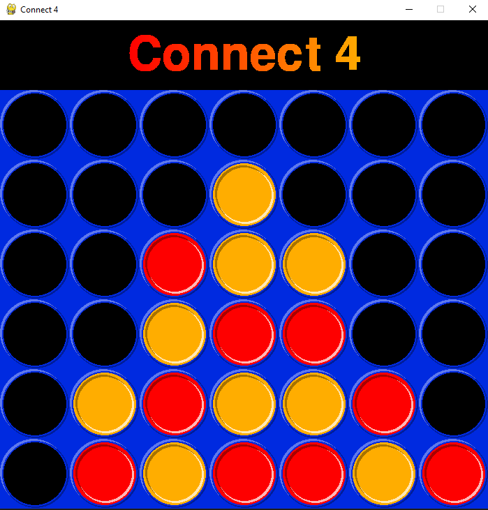

# Connect 4 Game with AI

## Description

This Python implementation of the classic game "Connect 4" allows you to play against a computer opponent with two difficulty levels:
a simple AI (weak) and a challenging AI (strong).
The game is developed using the Pygame library.


## Author

**Author:** Mathis Delsart

## Prerequisites

Before running the game, ensure you have Python and Pygame installed on your system.
You can install Pygame using pip:
```bash
pip install pygame
```

## Usage

Clone this repository to your local machine:
```bash
git clone https://github.com/Mathis003/Connect4_AI.git
```

Run the game:
```bash
python main.py
```

## How to Play
- Launch the game, and you will be presented with a menu.
- Choose to play against the weak AI or the strong AI by pressing '1' or '2', respectively.
- Use your mouse to select a column to drop your colored disc.
- The goal is to connect four of your discs in a row, either horizontally, vertically, or diagonally, before your opponent does.
- The game will announce the winner or declare a draw.


## Acknowledgments
The game logic and AI algorithms are based on classic Connect 4 rules and strategies.
The weak AI makes random moves, except when the player or the AI can win on the next move.
The strong AI use the minimax algorithm for intelligent gameplay.

## Screenshots

# <p align="center">  </p>